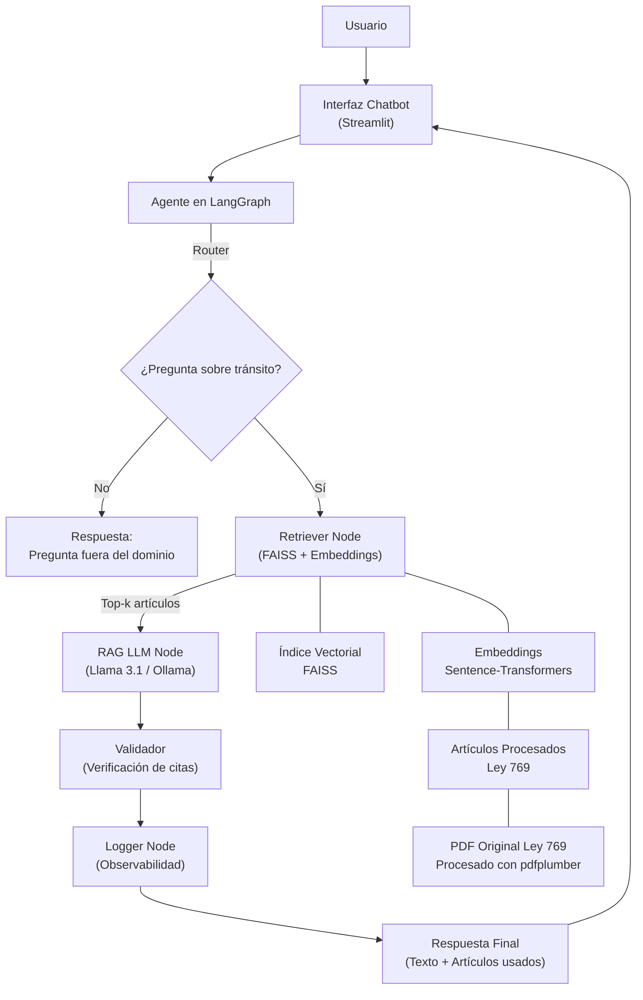

# Chatbot Jurídico RAG · Ley 769 de 2002 (Código Nacional de Tránsito)

Este proyecto implementa un **chatbot legal especializado** en la Ley 769 de 2002 (Código Nacional de Tránsito de Colombia) utilizando técnicas modernas de **Procesamiento de Lenguaje Natural (PLN)**, **RAG (Retrieval-Augmented Generation)** y **modelos de lenguaje abiertos (LLMs)**.  
El objetivo es permitir que cualquier usuario pueda realizar preguntas sobre normativa de tránsito y obtener respuestas **precisas, explicadas en lenguaje claro y siempre citando los artículos relevantes de la ley**.

El proyecto forma parte del curso de PLN, cumpliendo los lineamientos de creación de un sistema interactivo que procese lenguaje natural, recupere información y genere respuestas interpretables. También se incluye un componente voluntario de **observabilidad** para analizar el desempeño del sistema durante su uso.

---

## 🚀 Objetivo del Proyecto

Construir un **agente conversacional inteligente** capaz de responder preguntas jurídicas basadas exclusivamente en la Ley 769 de 2002.  
El sistema debe:

1. Procesar el texto oficial de la ley.
2. Dividirla en artículos y generar una base estructurada.
3. Crear una capa de búsqueda semántica mediante **embeddings gratuitos**.
4. Recuperar los artículos relevantes ante cada consulta.
5. Generar respuestas explicadas y citadas mediante un **LLM open-source**.
6. Ofrecer una **interfaz interactiva tipo chatbot**.
7. Registrar métricas y logs para un módulo de **observabilidad del LLM**.

---

## 🧠 Tecnologías principales

- **LLM gratuito**: Llama 3.1 (8B) ejecutándose localmente con **Ollama**.
- **Embeddings gratuitos**: `sentence-transformers/paraphrase-multilingual-MiniLM-L12-v2`.
- **Búsqueda semántica**: FAISS (índice vectorial local).
- **PLN y pipeline RAG**: LangChain.
- **Orquestación del agente**: LangGraph.
- **Interfaz del chatbot**: Streamlit.
- **Extracción de información del PDF**: pdfplumber.
- **Lenguaje**: Python 3.10+.
- **Observabilidad**: Logs estructurados (tiempo, latencia, artículos recuperados, feedback).

Todo el proyecto funciona **100% offline y sin costos**, gracias al uso de modelos y herramientas open-source.

---




## 📁 Estructura del Proyecto

```text
pln-transito-chatbot/
├── data/
│   ├── raw/          # PDF original de la Ley 769
│   ├── interim/      # Texto extraído sin procesar
│   └── processed/    # Artículos limpios y base estructurada para RAG
├── src/              # Código del procesamiento, embeddings, índice y agente
├── app/              # Interfaz del chatbot en Streamlit
├── logs/             # Observabilidad del LLM
├── report/           # Informe final del proyecto
└── README.md

## 📘 PASO 3 — Construcción de Embeddings y Creación del Índice FAISS

Una vez procesada la Ley 769 de 2002 y convertida en una tabla estructurada de 180 artículos, el siguiente paso fue habilitar la búsqueda semántica mediante **RAG (Retrieval-Augmented Generation)**.  
Para ello se construyeron:

1. **Embeddings** (representaciones vectoriales) para cada artículo.  
2. Un **índice FAISS** que permite realizar búsquedas rápidas y eficientes sobre esos vectores.

Este paso es fundamental para que el agente pueda recuperar los artículos más relevantes ante cualquier pregunta del usuario.

---

### 🔹 1. Modelo de Embeddings (Gratis y Local)

Se utilizó un modelo gratuito y open-source de `sentence-transformers`:

- **paraphrase-multilingual-MiniLM-L12-v2**

Ventajas:

- Multilingüe (incluye español)
- Ligero y rápido
- No requiere GPU
- Funciona completamente offline
- Excelente desempeño para tareas de recuperación semántica

El modelo transforma cada artículo en un vector de dimensión fija (384 dimensiones).

---

### 🔹 2. Embeddings generados

Para los 180 artículos de la Ley 769 se generaron 180 embeddings, almacenados en:


Cada embedding es un vector representativo del contenido del artículo, permitiendo medir similitud semántica entre la pregunta del usuario y el texto legal.

---

### 🔹 3. Construcción del Índice FAISS

Con los embeddings ya generados, se creó un índice vectorial utilizando **FAISS (Facebook AI Similarity Search)**, una herramienta especializada para realizar búsquedas por similitud de manera eficiente.

El índice permite:

- Recuperar los artículos más similares a una pregunta
- Consultas rápidas incluso con miles de vectores
- Filtrar artículos relevantes como primer paso del RAG

El índice quedó guardado en:


---

### 🔹 4. Resultado del proceso

✔ El modelo de embeddings se cargó correctamente  
✔ Se generaron embeddings para los 180 artículos  
✔ Se construyó el índice FAISS  
✔ Todos los archivos quedaron guardados en `data/processed/models/`

Este paso deja lista la infraestructura de recuperación para el siguiente módulo:  
**el RAG simple**, donde el sistema será capaz de:

- Tomar una pregunta del usuario
- Convertirla en embedding
- Buscar los artículos más relacionados
- Retornar el top-k para generar una respuesta con Llama 3.1

---

### 📌 Qué sigue

En el siguiente paso se implementará el **RAG Simple**, que permitirá:

- Consultar artículos relevantes
- Enviar el contexto al LLM (Llama 3.1 – Ollama)
- Generar respuestas legales claras y citadas


🧠 Paso 4 — Construcción del RAG Simple
En esta fase se implementó la primera versión del sistema RAG (Retrieval-Augmented Generation), utilizando los artículos procesados de la Ley 769, los embeddings locales y el índice FAISS previamente construido.
El flujo del RAG simple es:
El usuario hace una pregunta sobre tránsito.
El sistema genera embeddings de la pregunta.
Se busca en el índice FAISS los artículos más similares (top-k).
Se arma un prompt contextual con los artículos recuperados.
El LLM Llama 3.1 (ejecutándose localmente en Ollama) genera la respuesta:
clara
explicada en español
citando artículos relevantes
Se muestran tanto la respuesta como los artículos usados.
Este RAG simple sirve como la base para el agente más avanzado que se construirá en LangGraph en los siguientes pasos.
Permite validar que todo el pipeline datos → embeddings → FAISS → LLM esté funcionando correctamente.
✔️ Ejemplo real ejecutado:
Pregunta: ¿Qué pasa si me paso un semáforo en rojo?

Respuesta del sistema:
Según la Ley 769 de 2002, artículo 118...
[texto…]

Artículos usados:
118, 65, 90
✔️ Componentes del RAG Simple
Embeddings: sentence-transformers/paraphrase-multilingual-MiniLM-L12-v2
Índice vectorial: FAISS (local)
Modelo generador: Llama 3.1 (vía Ollama)
Pila tecnológica: Python + LangChain
📌 Objetivo del paso
Validar que la búsqueda semántica y la generación contextual funcionan correctamente antes de crear el Agente en LangGraph.

## 🧩 Paso 5 — Construcción de los Nodos del Agente (LangGraph)

En este paso comenzamos la transición desde un sistema RAG simple hacia un **Agente completo basado en LangGraph**, capaz de razonar sobre el flujo de la conversación y ejecutar acciones estructuradas.

Para ello, creamos el módulo `nodes.py`, que contiene los **nodos fundamentales del agente**, cada uno representando una operación clave en el pipeline:

### 🔹 1. Router Node
Determina si la pregunta del usuario pertenece o no al dominio del agente (Ley 769 de 2002 - tránsito colombiano).  
Si la pregunta no está relacionada, el nodo genera una respuesta adecuada fuera del dominio.

### 🔹 2. Retriever Node
Se encarga de buscar los artículos relevantes utilizando:
- el índice FAISS creado en el paso anterior  
- los embeddings generados con Sentence-Transformers  

El nodo retorna el conjunto top-k de artículos más similares.

### 🔹 3. RAG LLM Node
Genera una respuesta usando:
- el contexto recuperado por FAISS  
- el modelo Llama 3.1 (ejecutado localmente con Ollama)

Este nodo produce una respuesta completa en lenguaje natural, citando los artículos relevantes.

### 🔹 4. Validador Node
Verifica que la respuesta del LLM:
- cite artículos reales  
- no incluya información fuera del contexto recuperado  
- no presente alucinaciones obvias  

En caso necesario, puede solicitar un reintento o ajustar la respuesta.

### 🔹 5. Logger Node
Registra la interacción del usuario para el módulo de observabilidad:
- pregunta  
- artículos recuperados  
- respuesta generada  
- latencia  
- feedback del usuario (si aplica)

Los logs se guardan en `logs/` para análisis posterior.

---

En conjunto, estos nodos componen el **corazón del Agente RAG**, permitiendo un flujo robusto, modular y monitoreable, listo para conectarse en el siguiente paso al grafo completo de LangGraph.
